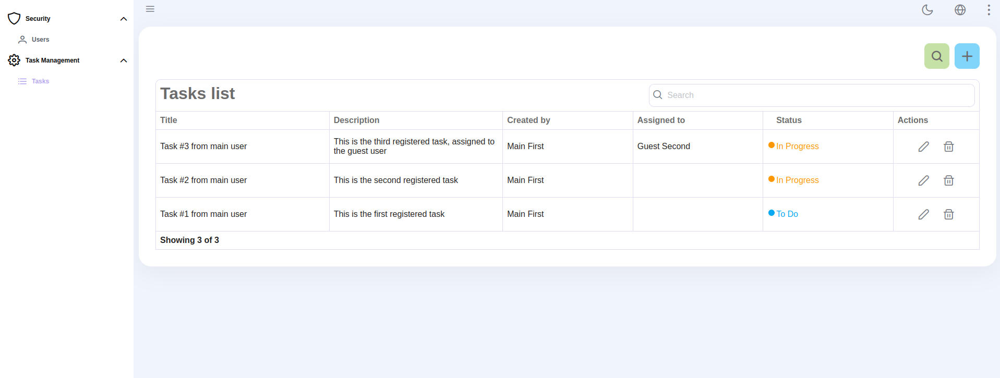
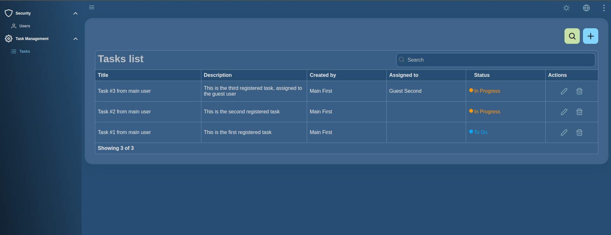
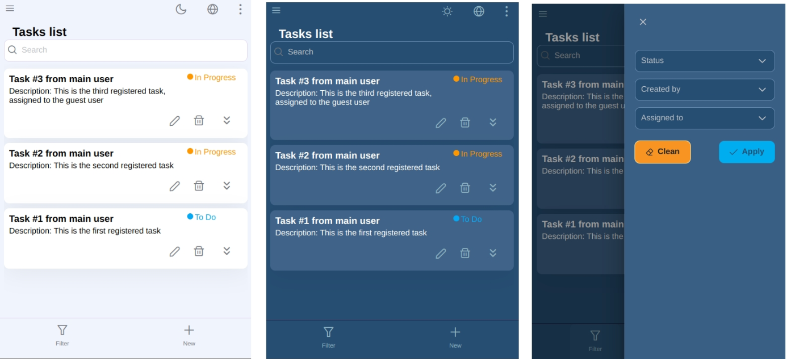

# Simple Task-Management
[](MIT)

Simple task management application that provides a streamlined and user-friendly interface for managing tasks.

## Table of Contents

- [About the Project](#about-the-project)
- [Getting Started](#getting-started)
  - [Prerequisites](#prerequisites)
  - [Project architecture](#project-architecture)
  - [How to run this project(Installation)](#installation)
    - [Using Docker](#using-docker)
    - [Running the project directly](#running-the-project-directly)
    - [Using Make file](#running-the-project-using-make-file)
   - [Unit Test](#unit-test)
- [Usage](#usage)
- [Special features](#special-features)
- [Environtment Setup(if needed)](#environment-setup)
  - [Docker setup](#docker-setup)
  - [Local environtment](#local-environment)
- [Project images](#project-images)
## About the Project

This project is a user-friendly task management application designed to help users efficiently create, update, and delete tasks. The application allows users to manage their tasks with ease by providing a form to add new tasks, a dynamic list to view and update existing tasks, and filtering options to sort tasks by status ("To Do," "In Progress," "Done").

## Getting Started

### Prerequisites

List any software or tools that are necessary to run your project:

- Docker
- Docker Compose

Optional if you rather to run this project not using docker:
- Node.js
- Vuejs
- Go(Golang)

## Project architecture
- Design pattern: this project uses Hexagonal Architecture on both frontend and backend
- Database: The project run using SqLite(database file)
- Frontend: Vuejs
- Backend: Go(Golang)

### Installation

Steps to get the development environment running.

## Using docker
1. Once you are on the root folder on the project, please open a CMD or terminal and run this command:
   ```sh
   # Pre-build version (docker image stored on docker hub)
   docker-compose up

   # Build version

   # Backend:
   docker-compose -f ./backend/docker-compose-build.yml up

   # Frontend
   docker-compose -f ./frontend/docker-compose-build.yml up

2. Open a web browser and navigate to the following URL:
   ```sh   
   http://localhost:5001/
   
   Enter the following credentials:
   Username: main
   Password: 12345

## Running the project directly
1. Open a CMD or terminal, then locate inside frontend folder and run(this is for running the frontend):
   ```sh
   npm install
   npm run dev

2. Open a CMD or terminal, then locate inside backend folder and run(this is for running the API):
   ```sh
   go mod download
   go run ./cmd/migration/main.go
   go run ./cmd/bin/main.go
  
3. Open a web browser and navigate to the following URL:
   ```sh
   http://localhost:5001/
   Enter the following credentials:
   Username: main
   Password: 12345

## Unit test
1. Backend: To run unit test on backend please locate inside backend folder and use the following command in a terminal:
   ```sh
   # Native
   go test ./...

   # Using docker
   docker build -f ./DockerfileTest -t go-test-image .

   docker run --rm go-test-image

2. Frontend: To run unit test on frontend please locate inside frontend folder and use the following command in a terminal:
   ```sh
   # Native
   npm run test:unit

   # Using docker
   docker build -f ./DockerfileTest -t vue-test-image .

   docker run --rm vue-test-image

## Usage
1. Open a web browser and navigate to the following URL: http://localhost:5001/

2. Enter the following credentials:<br>
Username: main<br>
Password: 12345

3. For loging using the guest user, please use the following credentials:<br>
Username: guest<br>
Password: 12345

4. Once you login, you will be redirected to the task administration section. Please take the following considerations:
    - You will only see the task created by yourself or related to you.
    - You can create a new task by clicking on the "New" button.
    - You can edit a task by clicking on the "Edit" button.
    - You can filter the tasks by clicking the "Filter" button.

## Special features
1. Implementation of i18n for multi-language support(English, Spanish, etc.).
2. Mobile friendly design. Not only designed to be responsive but to be easy to use on mobile devices. 
3. The interface support Dark Mode.
4. Scroll pagination.

## Environment setup
### Docker-setup
1. Open a CMD or terminal and run this command:
   ```sh
   # For Linux(debian based)
   sudo apt update
   sudo apt install docker.io
   sudo apt install docker-compose

   # For Microsoft Windows
   Download and install Docker Desktop from:  https://docs.docker.com/desktop/install/windows-install/

### Local environment
1. Open a CMD or terminal and install nodejs:
   ```sh
   # For Linux(debian based)
   sudo apt update
   sudo apt install nodejs
   sudo apt install npm

   # For Microsoft Windows
   Download and install Nodejs(version 16) from:  https://nodejs.org/en/download/prebuilt-installer

2. For installing golang, please visit the following URL and follow the instructions:
   ```sh
   https://go.dev/doc/install


### Project images






